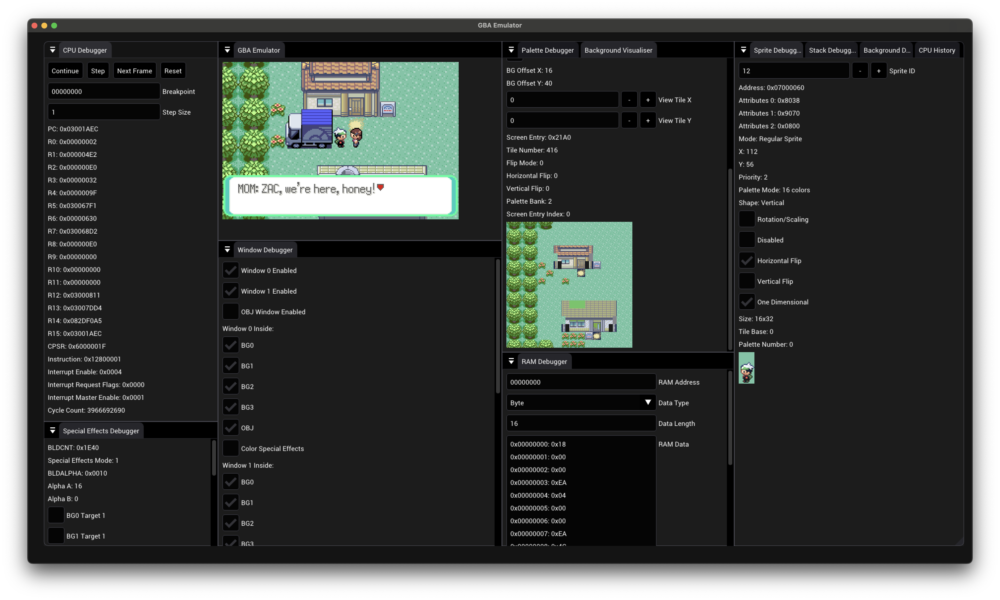

# gba-emulator

Toy Game Boy Advance emulator written in C++.

Powered by [ZEngine](https://github.com/zacbrannelly/zengine).



## Usage

```bash
./run_emulator.sh
```

> NOTE: There are a lot of set up steps required to get this running. This is a work in progress. Will write better instructions once it's more stable.
